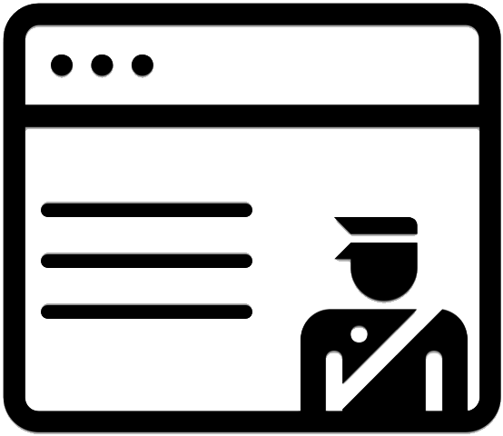

# React Safe Srcdoc Iframe

> A component which applies guards to srcdoc iframes in order to provide a predictable and safe experience to the user. Compliments the `sandbox` native iframe attribute.

<p align="center">
  
</p>

## Table of Contents

- [The Problem](#the-problem-)
- [This Solution](#this-solution-)
- [Guards](#guards-)
- [Install](#install)
  - [Import Examples](#import-examples)
- [Usage Example](#usage-example-)
- [Component Props](#component-props-)
  - [referrerPolicy](#referrerpolicy)
  - [sandbox](#sandbox)
  - [srcDoc](#srcdoc)
  - [title](#title)
- [Special Thanks](#special-thanks-)
- [License](#license-)
- [Changelog](/CHANGELOG.md)
- [Security](/SECURITY.md)

## The Problem 🔴

You need to render an html document, for which you have the source locally, into an iframe on your `React` application. However, you would like some guards applied to the document in order to provide a safe and consistent experience to the user. For example, preventing clicks on elements which could lead to page navigation.

## This Solution 🔵

This component compliments the `sandbox` iframe attribute. It will take the html document source code which you provide through the `srcDoc` component prop and inject safeguards on document load.

## Guards 👮

The following guards are applied to the document:

- disable pointer events on any element with an href attribute, buttons, and images.
- only whitelist the "allow-same-origin" `sandbox` attribute flag for guard injection into the document.
- `referrerPolicy` set to "no-referrer".

## Install

```npm install --save react-safe-src-doc-iframe```

Or

```yarn add react-safe-src-doc-iframe```

> Note this package also depends on `react` and `prop-types`. Ensure they are installed or available beforehand.

### Import Examples

```javascript
// 1) es6 module
import SafeSrcDocIframe from 'react-safe-src-doc-iframe';

// 2) commonjs
const SafeSrcDocIframe = require('react-safe-src-doc-iframe').default;

// 3) window
const SafeSrcDocIframe  = window.SafeSrcDocIframe;
```

## Usage Example 📝

> ▶️ [Try it out on CodeSandbox!](https://codesandbox.io/s/2z4nk0nq4j)

```jsx
import React from 'react';
import SafeSrcDocIframe from 'react-safe-src-doc-iframe';

const html = `
  <!DOCTYPE html>
  <html>
    <head>
      <title>My Cats Page</title>
    </head>
    <body>
      <a href="https://link-to-about-page.com">About</a><br />
      <a href="https://link-to-awesome-cats.com"></a><br />
      <button onclick="navigate();">Click me to see more cats!</button>
    </body>
  </html>
`;

const App = () => {
  return <SafeSrcDocIframe srcdoc={html} width="500" height="500" />;
};
```

## Component Props

> Note: any prop not specified here will be forwarded to the native iframe element. **However**, if `src` is passed, it will always be filtered out.

### referrerPolicy

> `string` | optional. Default value: `no-referrer`.

### sandbox

> `string` | optional. Default value: `allow-same-origin` (for safeguard injection).

The value for the `sandbox` iframe attribute.

### srcDoc

> `string` | required.

Source of the html document to render.

### title

> `string` | required.

Provide a title for the iframe in order to help screen reader users. [More info](https://github.com/evcohen/eslint-plugin-jsx-a11y/blob/master/docs/rules/iframe-has-title.md)

## Special Thanks 👏

- ["guard" icon](https://thenounproject.com/search/?q=guard&i=225519) created by Jason Gray, from [the Noun Project](https://thenounproject.com/). Used with attribution under Creative Commons.
- ["Browser" icon](https://thenounproject.com/search/?q=browser&i=1850566) created by Wira, from [the Noun Project](https://thenounproject.com/). Used with attribution under Creative Commons.
- [Downshift for the README format inspiration :)](https://github.com/paypal/downshift)

## License 📋

[MIT](LICENSE)
